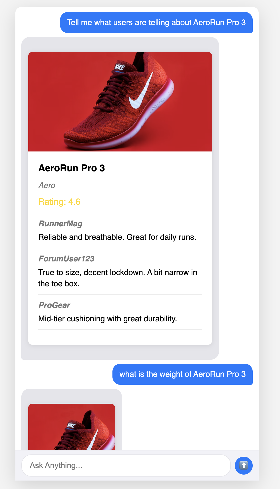
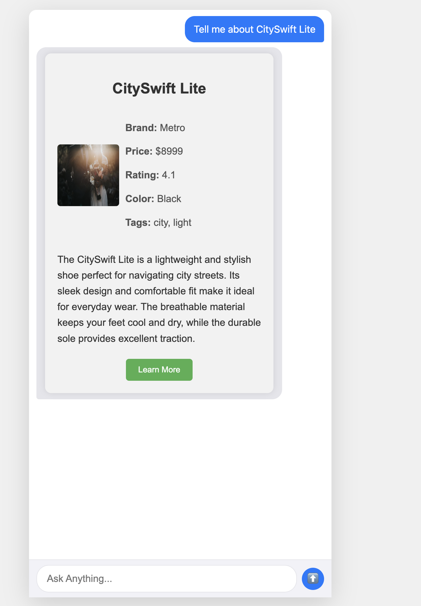

# Dynamic UI Generator with Gemini

This project is a Flask-based web application that dynamically generates user interfaces using Google's Gemini Pro model. The application takes a user's natural language prompt and generates HTML, CSS, and JavaScript to create a UI component on the fly.

## Features

*   **Dynamic UI Generation:** Leverages the Gemini Pro model to create UI components from natural language prompts.
*   **Flask Backend:** A simple and lightweight web server to handle user requests and serve the application.
*   **Real-time Interaction:** Users can type in what they want to see, and the UI is generated and displayed instantly.
*   **Easy to Customize:** The system prompt for the Gemini model can be easily modified to change the style and behavior of the generated UI.

*   **Easy to Customize:** The system prompt for the Gemini model can be easily modified to change the style and behavior of the generated UI.

## Technologies Used

*   **Flask:** A lightweight WSGI web application framework in Python.
*   **Google Gemini:** The AI model used for generating the dynamic UI.
*   **HTML/CSS/JavaScript:** The core technologies for building the web interface.


## Getting Started

These instructions will get you a copy of the project up and running on your local machine for development and testing purposes.

### Prerequisites

*   Python 3.7+
*   pip for installing Python packages

### Installation

1.  **Clone the repository:**

    ```bash
    git clone https://github.com/your-username/dynamic-ui.git
    cd dynamic-ui
    ```

2.  **Create and activate a virtual environment:**

    ```bash
    python -m venv env
    source env/bin/activate  # On Windows, use `env\Scripts\activate`
    ```

3.  **Install the required packages:**

    ```bash
    pip install -r requirements.txt
    ```

4.  **Set up your environment variables:**

    Create a `.env` file in the root of the project and add your Gemini API key:

    ```
    GEMINI_API_KEY=your_gemini_api_key
    ```

## Usage

1.  **Run the Flask application:**

    ```bash
    python app.py
    ```

2.  **Open your browser:**

    Navigate to `http://127.0.0.1:5000` to see the application in action.

## Screenshots

Here are a couple of screenshots showing the UI generated by Gemini:

**Screenshot 1:**



**Screenshot 2:**


